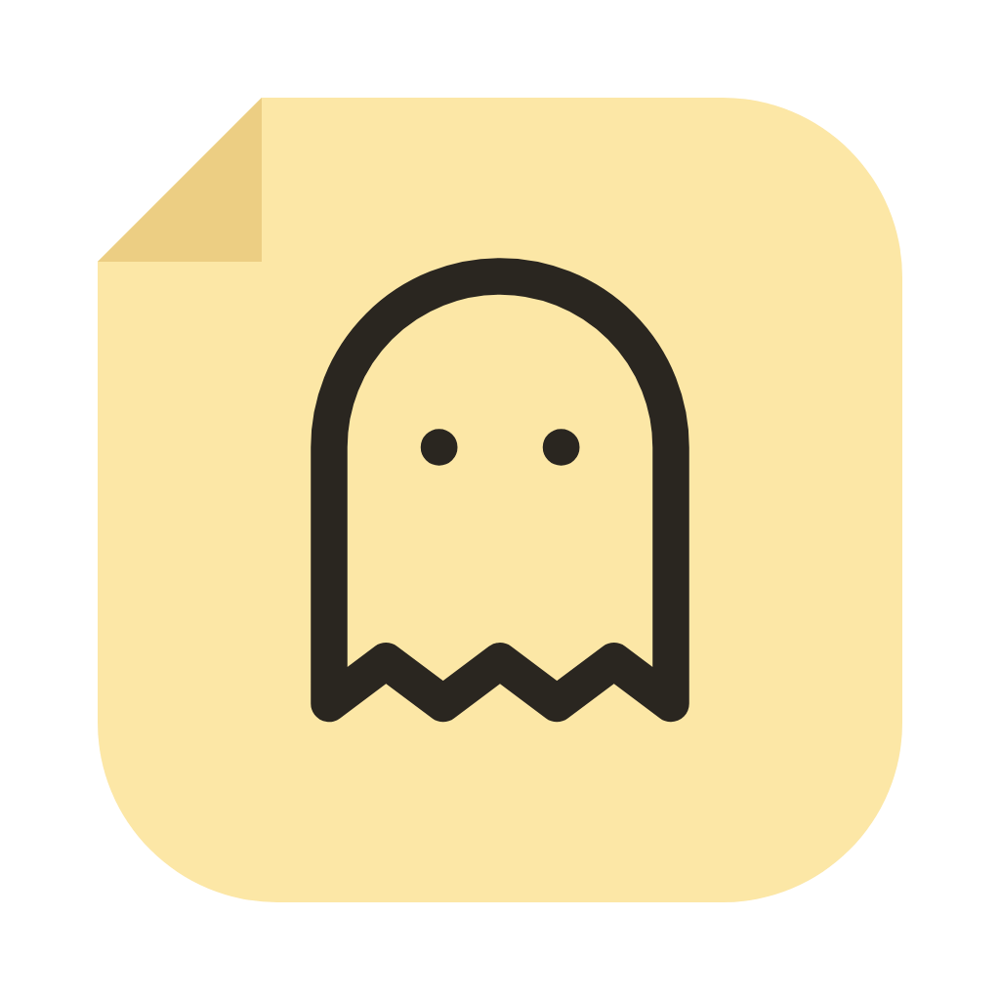
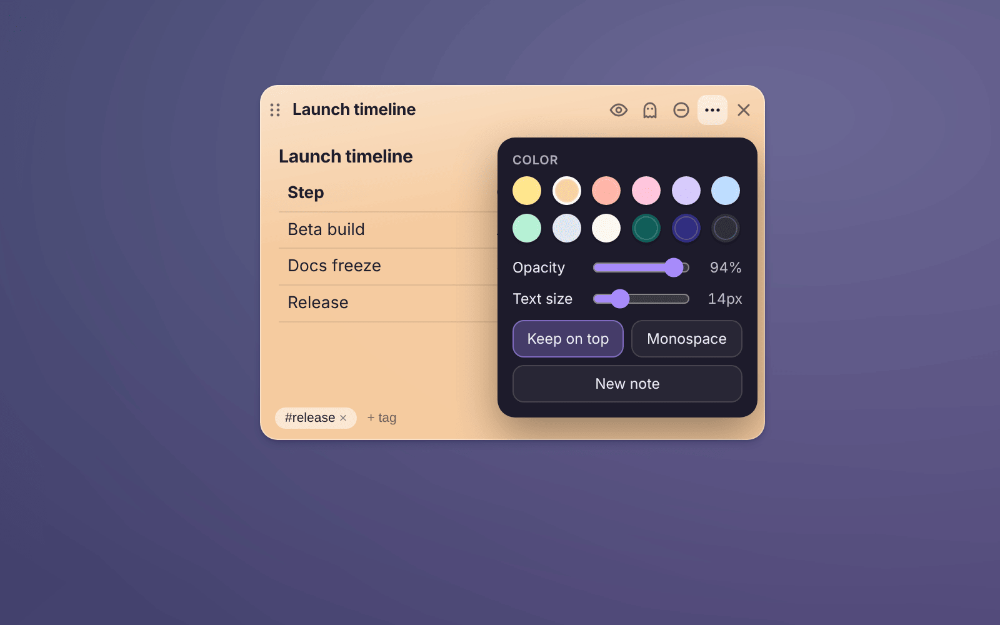
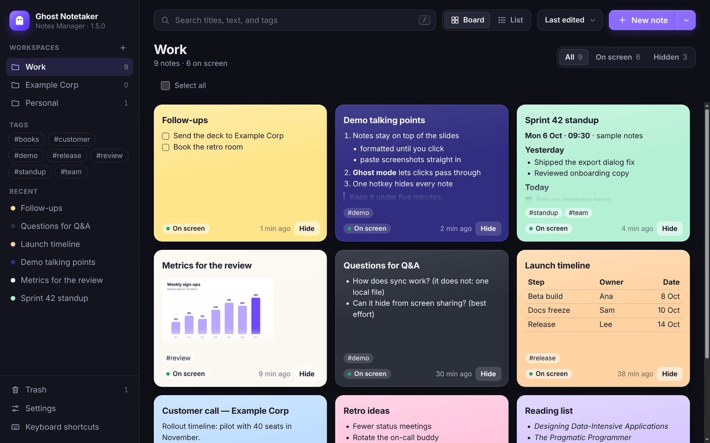
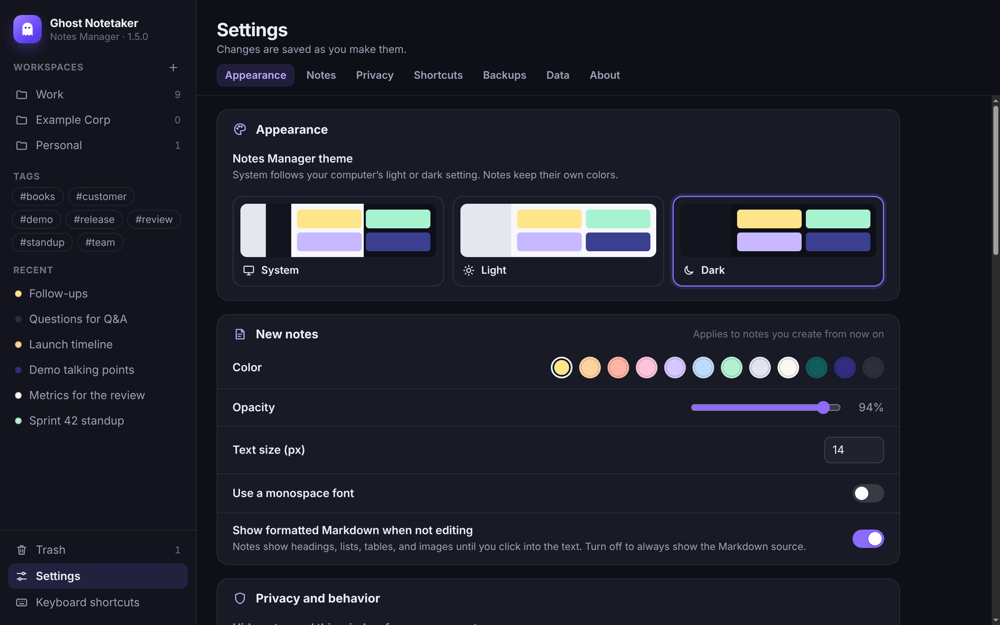
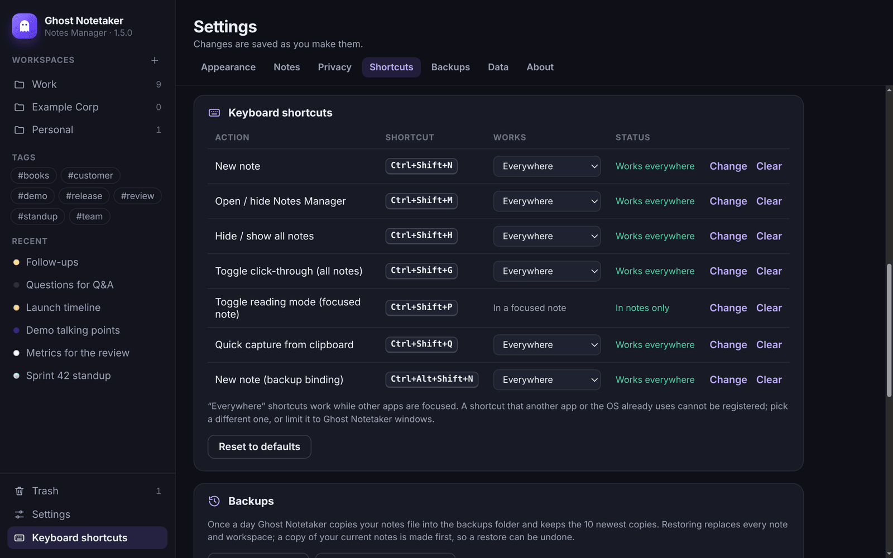

<p align="center">
  
</p>

<h1 align="center">Ghost Notetaker</h1>

<p align="center">
  Markdown sticky notes that float above your other windows, saved in one file on your computer.<br />
  macOS · Windows · Linux
</p>

<p align="center">
  <a href="#download">Download</a> ·
  <a href="#what-it-does">What it does</a> ·
  <a href="#keyboard-shortcuts">Shortcuts</a> ·
  <a href="#platform-support">Platform support</a> ·
  <a href="#your-data">Your data</a> ·
  <a href="#development">Development</a>
</p>

Ghost Notetaker is a desktop sticky-notes app. Each note is a small window that stays on top, shows formatted Markdown while you are not typing, and turns back into plain text when you click it. Notes can hold pasted screenshots, shrink to a bubble at the edge of the screen, and pass mouse clicks through to the window underneath. Everything is kept in one JSON file on your computer: there is no account, no sync, and no network service.

On macOS and Windows, notes ask the operating system to leave them out of screenshots, recordings, and screen shares. That protection is best effort: some capture tools ignore it, and Linux has no equivalent (see [Screen-capture hiding](#screen-capture-hiding)). Despite the name, the app does not record audio, transcribe, or summarize anything.


*Recorded from the Linux build with sample data. The white pointer and the click rings were drawn afterwards from the recorded mouse positions, because the recording display draws its own pointer too small to see.*

## Download

Installers are attached to each [GitHub release](https://github.com/skysssup/ghost-notetaker/releases/latest).

| Platform | File |
| --- | --- |
| macOS 12 or later, Apple silicon | `ghost-notetaker-<version>-mac-arm64.dmg` (or `.zip`) |
| macOS 12 or later, Intel | `ghost-notetaker-<version>-mac-x64.dmg` (or `.zip`) |
| Windows 10 or 11, 64-bit | `ghost-notetaker-<version>-win-x64-setup.exe` |
| Linux x64, Debian or Ubuntu | `ghost-notetaker-<version>-linux-amd64.deb` |
| Linux x64, other distributions | `ghost-notetaker-<version>-linux-x86_64.AppImage` |

`SHA256SUMS.txt` lists a checksum for every file. After downloading, check yours with `sha256sum -c SHA256SUMS.txt --ignore-missing` (Linux) or `shasum -a 256 -c SHA256SUMS.txt --ignore-missing` (macOS).

The builds are not signed with an Apple or Microsoft certificate, so the first launch needs one extra step:

- **macOS**: open the `.dmg` and drag Ghost Notetaker to Applications. The app is ad-hoc signed but not notarized, so macOS refuses to open it at first. Open **System Settings → Privacy & Security**, choose **Open Anyway** next to the Ghost Notetaker message, and confirm. On macOS 14 and earlier you can instead Control-click the app and choose **Open**.
- **Windows**: if SmartScreen shows "Windows protected your PC", choose **More info → Run anyway**. The installer can install for your user only or for everyone, and it adds Start menu and desktop shortcuts.
- **Linux (.deb)**: `sudo apt install ./ghost-notetaker-<version>-linux-amd64.deb`, then start Ghost Notetaker from your applications menu.
- **Linux (AppImage)**: `chmod +x ghost-notetaker-*.AppImage` and run it. AppImages need FUSE 2; on Ubuntu 22.04 or later install it with `sudo apt install libfuse2t64` (`libfuse2` on 22.04), or run the file with `--appimage-extract-and-run`.

The app runs in the tray (menu bar on macOS) and has no Dock icon on macOS. The first launch opens a welcome note. Open the Notes Manager from the tray menu or with `Ctrl+Shift+M` (`⌘⇧M` on macOS); launching the app again while it runs does the same.

## What it does


*Formatted notes, one note open for editing (bottom left), and a note collapsed to a bubble (right).*

### Notes

- **Always on top, out of the way.** Notes are frameless windows that stay above other apps (unpin a note to let it fall behind), can be dragged by their top bar and resized, and reopen where you left them. Closing a note only hides it.
- **Formatted until you click.** A note shows formatted Markdown when you are not typing in it. Click a line to edit the source with the caret on that line; click anywhere else, or press `Esc`, to see it formatted again. Reading mode (the eye button) keeps a note formatted even when clicked, and **Settings → Show formatted Markdown when not editing** turns the behavior off.
- **Markdown.** Headings, bold, italic, strikethrough, inline and fenced code, links, nested bullet and numbered lists, checklists you can tick in the formatted view, quotes, dividers, and tables with column alignment. A toolbar and `Ctrl/⌘+B`, `I`, and `K` help with writing, and toolbar edits can be undone.
- **Images.** Paste a screenshot or drop a PNG, JPEG, GIF, or WebP file (up to 10 MB) onto a note. The file is stored next to your notes file and shown in the note and in the Notes Manager. Images on the web are not loaded; a remote image link stays a link.
- **Bubbles.** The **–** button shrinks a note to a small round bubble that shows the note's color and initial. Drag the bubble anywhere; click it to open the note at that spot. Bubbles stay bubbles after a restart.
- **Appearance.** Twelve colors, including three dark ones with light text, plus opacity, text size, and a monospace option for each note.
- **Click-through ("ghost mode").** Turn it on for one note or for all notes, and mouse clicks pass through to the window underneath.
- **Quick capture.** One shortcut makes a new note from the text on your clipboard.



*Hover a note to show its controls. The ⋯ button opens its appearance settings.*

### Notes Manager



- **Board and list views.** Cards show each note in its own color with a formatted preview, images included. The list view is a compact table. The app remembers your choice.
- **Light, dark, or system theme** for the Notes Manager. Notes keep their own colors.
- **Find notes.** Search titles, text, and tags; filter by tag and by notes on screen or hidden, with counts; sort by last edit, creation, title, or color.
- **Per-note menu.** The ⋯ button (or a right-click) shows or hides a note and can rename it, edit its tags, change its color, move it to another workspace, duplicate it, export it as Markdown, or move it to the trash. Double-click a title or press `F2` to rename it in place.
- **Keyboard.** `/` searches, the arrow keys move between notes, `Enter` shows the note on screen, `Space` selects it, `Delete` moves it to the trash, and `Ctrl/⌘+N` makes a new note.
- **Workspaces, templates, and bulk actions.** Group notes into workspaces, start from eight templates (meeting, standup, todo, bug triage, decision log, talking points, scratch pad, or blank), and show, hide, or trash several notes at once.


*Recorded from the Linux build with sample data; the pointer was drawn afterwards from the recorded mouse positions.*

### Safety nets

- **Trash with Undo.** Deleting a note, or a whole workspace, moves its notes to the trash. The message that appears has an Undo button, and **Trash** in the Notes Manager can restore notes for 30 days before they are deleted for good.
- **Daily backups.** Once a day the app copies your notes file into a backups folder and keeps the 10 newest copies. **Settings → Backups** lists them, makes one on demand, and restores one. A restore saves your current notes as a new backup first, so it can be undone. Backups do not include image files; images stay in `images/` for as long as a backup refers to them.
- **Export and import.** **Export all notes** writes one JSON file with every note, workspace, and pasted image. Import it on another computer, merged with your notes or replacing them. A single note can be exported as a Markdown file with its images embedded.
- **Careful saving.** Changes are written shortly after you type, through a temporary file that is renamed over the old one. If the disk refuses a write, the text stays in the app and saving is retried until it works.



*Settings are saved as you change them. Sections: Appearance, New notes, Privacy and behavior, Keyboard shortcuts, Backups, Data, and About.*

## Keyboard shortcuts

| Action | Default |
| --- | --- |
| New note | `Ctrl+Shift+N` |
| Open or hide the Notes Manager | `Ctrl+Shift+M` |
| Hide or show all notes | `Ctrl+Shift+H` |
| Click-through for all notes | `Ctrl+Shift+G` |
| Quick capture from the clipboard | `Ctrl+Shift+Q` |
| New note (backup binding) | `Ctrl+Alt+Shift+N` |
| Reading mode for the focused note (only inside notes) | `Ctrl+Shift+P` |

On macOS, `Ctrl` is `⌘`. Global shortcuts take priority over other apps while Ghost Notetaker runs, and some defaults overlap with common ones (for example, Microsoft Teams uses `Ctrl+Shift+M` to mute). In **Settings → Keyboard shortcuts** you can change or clear each one, see whether the operating system accepted it, and set it to work **Everywhere** or only **In Ghost Notetaker** windows, which leaves the key combination free for other apps.



## Platform support

The table describes what the operating system lets the app do. Everything else, including formatted notes, images, bubbles, the Notes Manager, the trash, and backups, works the same on all three.

| | macOS | Windows | Linux (X11) |
| --- | --- | --- | --- |
| Hide notes from screen capture | Best effort (see below) | Windows 10 version 2004 or later | Not available |
| Launch at login | Yes | Yes | Not available |
| Leave click-through by hovering a note's controls | Yes | Yes | No: turn it off in the Notes Manager, the tray menu, or with the shortcut |
| Tray icon | Menu bar | Notification area | Needs a StatusNotifier/AppIndicator host (GNOME needs an extension) |

Where it has been run:

- **Automated end-to-end tests, then a smoke test of the built installer**: GitHub Actions on macOS 15 (Apple silicon and Intel), Windows Server 2025, and Ubuntu 24.04.
- **Real mouse and keyboard input on Linux X11**: the X11 end-to-end tests send real input events with `xdotool` to drag notes and bubbles, click through notes, switch windows, and press global shortcuts. The animations above were recorded the same way.
- **Not tested**: physical Mac and Windows machines, real screen-sharing apps, and Wayland sessions. The packaged Linux launchers start the app under XWayland (`--ozone-platform=x11`) because Wayland does not let apps keep their own windows on top or position them.

[docs/TESTING.md](docs/TESTING.md) lists every feature, the test that checks it, and the result.

## Screen-capture hiding

When **Settings → Hide notes and this window from screen capture** is on (the default), Ghost Notetaker calls Electron's [`setContentProtection`](https://www.electronjs.org/docs/latest/api/browser-window#winsetcontentprotectionenable-macos-windows) on every note and on the Notes Manager.

- **Windows 10 version 2004 and later** exclude the windows from capture. On older versions they are captured as black rectangles.
- **macOS** marks the windows as not shareable. Apps that capture through ScreenCaptureKit can still record them, so a note may still appear in a recording or screen share.
- **Linux** has no such API. The option is disabled and notes appear in every capture.

It cannot stop someone from photographing your screen. Before relying on it, try your own screen-sharing or recording app with a test note.

## Your data

All notes, workspaces, and settings are kept in one file, with pasted images and daily backups in folders next to it:

| OS | Notes file |
| --- | --- |
| macOS | `~/Library/Application Support/ghost-notetaker/ghost-notetaker-data.json` |
| Windows | `%APPDATA%\ghost-notetaker\ghost-notetaker-data.json` |
| Linux | `~/.config/ghost-notetaker/ghost-notetaker-data.json` |

- `images/` holds pasted and dropped images under random names. An image is deleted once no note, no note in the trash, and no backup refers to it any more.
- `backups/` holds copies of the notes file: one a day, plus the ones made by **Back up now** and before a restore. The 10 newest are kept.
- On macOS and Linux the notes file, images, and backups are readable only by your user.
- If the notes file cannot be parsed at startup, it is renamed to `ghost-notetaker-data.json.corrupt.<timestamp>`, and you can start an empty notebook or quit. If it cannot be read at all (for example, a permissions problem), the app reports the error and exits without touching it.
- Quitting saves pending edits first. If that fails, the app asks before quitting without them.
- Imported notes arrive hidden. **Replace** keeps your current screen-capture setting instead of taking the one from the backup.

**Settings → Data** shows the file's location and opens its folder. The app makes no network requests of its own; clicking a link in a note opens it in your web browser. Spellcheck uses the operating system's spellchecker on macOS and Windows. On Linux it is turned off, because Chromium would download its dictionaries from Google's servers.

## Limitations

- The builds are unsigned (macOS: ad-hoc signed, not notarized). There is no automatic updater; download new versions from the releases page.
- Screen-capture hiding has the limits described above. Linux also lacks launch at login, spellcheck, and leaving click-through by hovering.
- Wayland sessions are untested. On Linux, global shortcuts are reliable only on X11, and notes can show up as taskbar entries (on Xfce, the hint that hides them from the taskbar is not set).
- The Markdown renderer is built in and small: no raw HTML, footnotes, syntax highlighting, or images from the web.
- There is no sync between computers. The notes file is rewritten on each save, and each note holds up to 200,000 characters.

## Development

Requires Node.js 22.12 or later.

```bash
npm ci
npm start              # run from source
npm test               # unit tests (no display needed)
npm run test:e2e       # end-to-end tests: launches the real app with Playwright
```

The end-to-end tests need a display. On Linux CI they run under `xvfb-run`, and the X11 tests (global shortcuts, dragging notes and bubbles, click-through, focus changes) also need `xdotool` and a window manager; without those, those tests are skipped. Each test uses its own temporary profile through `--user-data-dir`. The tests only replace the native file dialogs, the external-browser call, and the startup message box.

Building installers:

```bash
npm run dist:linux     # AppImage and .deb in dist/
npm run dist:win       # NSIS installer
npm run dist:mac       # .dmg and .zip for this Mac's architecture; add -- --x64 or -- --arm64 for the other one
npm run smoke:packaged # launch the unpacked build in dist/ and check the first-run workflow
```

`npm run icons` regenerates `build/*.png` from the SVG sources.

| Path | What it holds |
| --- | --- |
| `main/` | Electron main process: windows, tray, shortcuts, IPC, storage, backups, and images (`store.js`) |
| `renderer/note/` | Note window: editor, formatted view, Markdown renderer, save queue |
| `renderer/manager/` | Notes Manager: board and list, trash, settings |
| `test/` | Unit tests (`node --test`) |
| `e2e/` | End-to-end tests against the running app |
| `scripts/` | Packaged-app smoke test and icon rendering |

[`.github/workflows/build.yml`](.github/workflows/build.yml) runs the unit and end-to-end tests, builds the installers, and smoke-tests each one on Linux, Windows, and both Mac architectures. To publish a release, add a section to [CHANGELOG.md](CHANGELOG.md) and push a `v<version>` tag that matches `package.json`. The workflow then creates a draft GitHub release with the installers, `SHA256SUMS.txt`, and that changelog section; check it and publish it.

## License

[MIT](LICENSE) © 2026 Sky
