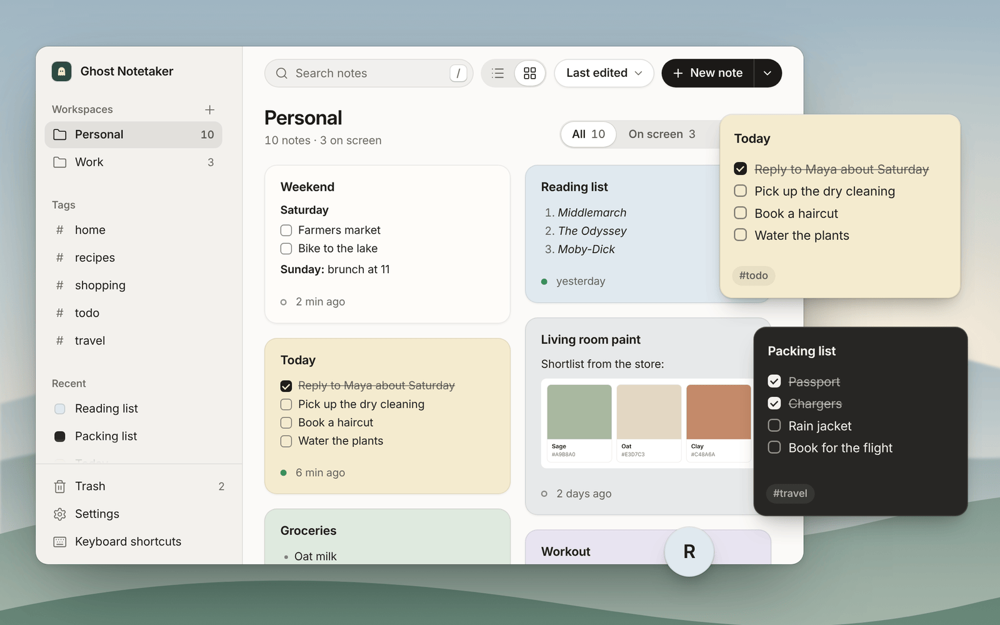
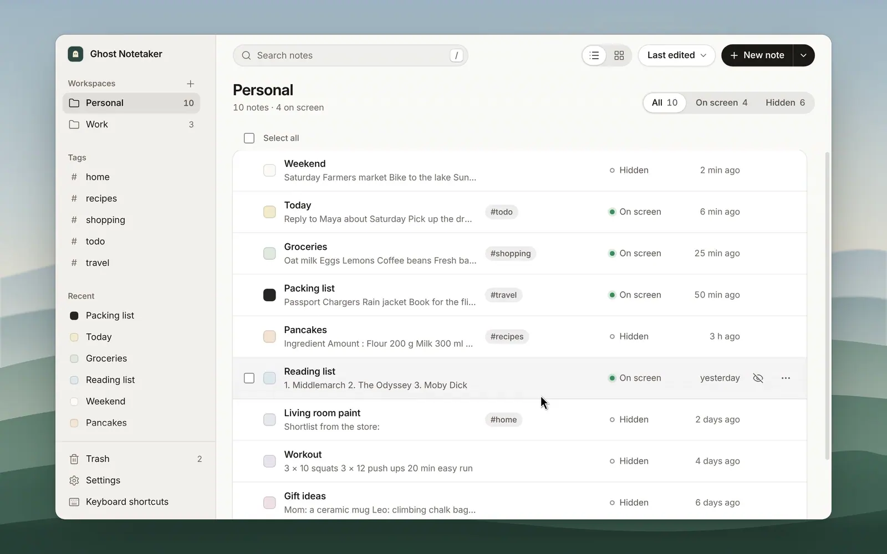

<div align="center">


# Ghost Notetaker

Markdown sticky notes that float above your other windows.

[**Download**](https://github.com/skysssup/ghost-notetaker/releases/latest) · macOS · Windows · Linux

</div>



- **Always on top.** Notes stay above other apps. Move, resize, or shrink one to a bubble.
- **Markdown.** Checklists, tables, code, links, and pasted images, shown formatted until you click in.
- **Kept out of screen shares.** On macOS and Windows, notes ask the system to leave them out of screenshots, recordings, and calls. This is best effort.
- **Notes Manager.** Search, tags, workspaces, templates, list and board views, a 30-day trash, and daily backups.
- **Local.** One file on your computer. No account, no sync, no network requests.

## Notes

[](docs/demo/notes.mp4)

## Notes Manager

[](docs/demo/manager.mp4)

## Install

Download the file for your system from the [latest release](https://github.com/skysssup/ghost-notetaker/releases/latest).

| System | File |
| --- | --- |
| macOS 12 or later | `ghost-notetaker-<version>-mac-arm64.dmg` (Apple silicon) or `-mac-x64.dmg` (Intel) |
| Windows 10 or 11 | `ghost-notetaker-<version>-win-x64-setup.exe` |
| Linux | `ghost-notetaker-<version>-linux-amd64.deb` or `-linux-x86_64.AppImage` |

The builds are not signed, so the first launch takes one extra step:

- **macOS:** open the app once, then choose **Open Anyway** in **System Settings → Privacy & Security**.
- **Windows:** choose **More info → Run anyway** if SmartScreen stops it.
- **Linux:** install the `.deb` with `sudo apt install ./ghost-notetaker-*.deb`, or `chmod +x` the AppImage (it needs FUSE 2).

The app lives in the tray (the menu bar on macOS) and opens with a welcome note.

## Shortcuts

| Action | Shortcut |
| --- | --- |
| New note | `Ctrl+Shift+N` |
| Open the Notes Manager | `Ctrl+Shift+M` |
| Hide or show all notes | `Ctrl+Shift+H` |
| Click-through for all notes | `Ctrl+Shift+G` |
| New note from the clipboard | `Ctrl+Shift+Q` |
| Reading mode, in a note | `Ctrl+Shift+P` |

On macOS, `Ctrl` is `⌘`. Change any of them in **Settings → Keyboard shortcuts**.

## Good to know

- Notes are saved in `ghost-notetaker-data.json` in `~/Library/Application Support/ghost-notetaker` (macOS), `%APPDATA%\ghost-notetaker` (Windows), or `~/.config/ghost-notetaker` (Linux). **Settings → Data** exports and imports everything.
- Screen-capture hiding has no Linux equivalent, and some macOS recorders ignore it. Try it with your own call or recording app first.
- There is no auto-update; new versions are on the releases page. On Linux, only X11 is tested.
- Despite the name, the app does not record or transcribe anything.

## Development

Requires Node.js 22.12 or later.

```bash
npm ci
npm start            # run from source
npm test             # unit tests
npm run test:e2e     # end-to-end tests
npm run dist:mac     # or dist:win, dist:linux
```

[docs/TESTING.md](docs/TESTING.md) lists what each test covers, and [scripts/demo](scripts/demo/README.md) makes the picture and videos above.

## License

[MIT](LICENSE)
