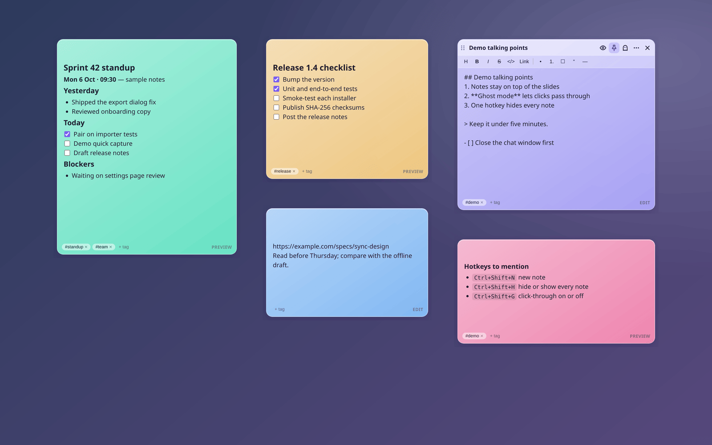

# Ghost Notetaker

Ghost Notetaker is a desktop sticky-notes app. Each note is a small Markdown window that stays on top of your other windows, and everything is saved to one JSON file on your computer. There is no account, no sync, and no network service.

On macOS and Windows, note windows ask the operating system to leave them out of screenshots, recordings, and screen shares. That protection is best effort: some capture tools ignore it, and Linux has no equivalent (see [Screen-capture hiding](#screen-capture-hiding)).

Despite the name, it is not a meeting assistant: it does not record audio, transcribe, or summarize anything.



*Notes on a Linux desktop. The focused note on the right shows its controls; the others are in Markdown preview, where checklist items can be ticked.*

## Download

Installers are attached to each [GitHub release](https://github.com/skysssup/ghost-notetaker/releases/latest).

| Platform | File |
| --- | --- |
| macOS 12 or later, Apple silicon | `ghost-notetaker-<version>-mac-arm64.dmg` (or `.zip`) |
| macOS 12 or later, Intel | `ghost-notetaker-<version>-mac-x64.dmg` (or `.zip`) |
| Windows 10 or 11, 64-bit | `ghost-notetaker-<version>-win-x64-setup.exe` |
| Linux x64, Debian or Ubuntu | `ghost-notetaker-<version>-linux-amd64.deb` |
| Linux x64, other distributions | `ghost-notetaker-<version>-linux-x86_64.AppImage` |

`SHA256SUMS.txt` lists a checksum for every file. After downloading, check yours with `sha256sum -c SHA256SUMS.txt --ignore-missing` (Linux) or `shasum -a 256 -c SHA256SUMS.txt --ignore-missing` (macOS).

The builds are not signed with an Apple or Microsoft certificate, so the first launch needs one extra step:

- **macOS**: open the `.dmg` and drag Ghost Notetaker to Applications. The app is ad-hoc signed but not notarized, so macOS refuses to open it at first. Open **System Settings → Privacy & Security**, choose **Open Anyway** next to the Ghost Notetaker message, and confirm. On macOS 14 and earlier you can instead Control-click the app and choose **Open**.
- **Windows**: if SmartScreen shows "Windows protected your PC", choose **More info → Run anyway**. The installer can install for your user only or for everyone, and it adds Start menu and desktop shortcuts.
- **Linux (.deb)**: `sudo apt install ./ghost-notetaker-<version>-linux-amd64.deb`, then start Ghost Notetaker from your applications menu.
- **Linux (AppImage)**: `chmod +x ghost-notetaker-*.AppImage` and run it. AppImages need FUSE 2; on Ubuntu 22.04 or later install it with `sudo apt install libfuse2t64` (`libfuse2` on 22.04), or run the file with `--appimage-extract-and-run`.

The app runs in the tray (menu bar on macOS) and has no Dock icon on macOS. The first launch opens a welcome note. To open the Notes Manager, use the tray menu or `Ctrl+Shift+M` (`⌘⇧M` on macOS). Launching the app again while it is running also opens the Notes Manager.

## Features

- **Floating notes.** Notes are frameless windows that stay on top (pin or unpin each note), can be dragged by their top bar and resized, and reopen where you left them. Closing a note only hides it.
- **Markdown.** A formatting toolbar and `Ctrl/⌘+B`, `I`, and `K` help with writing. The preview renders headings, emphasis, inline and fenced code, links, lists, checklists, quotes, and dividers. Ticking a checkbox in the preview updates the note text. Links open in your browser.
- **Appearance.** Each note has its own color (12 choices), opacity, text size, and monospace option.
- **Click-through ("ghost mode").** Turn it on for one note or for all notes, and mouse clicks pass through to the window underneath.
- **Notes Manager.** Search titles, text, and tags; filter by tag or by open and hidden notes; sort; and rename, retag, duplicate, move, export, or delete notes. Notes can be grouped into workspaces, created from seven templates (meeting, standup, todo, bug, decision, and more), and shown or hidden in bulk.
- **Quick capture.** One shortcut creates a note from the text on your clipboard.
- **Global shortcuts.** The shortcuts work while other apps are focused. You can change or clear them, and the app tells you when another app already owns one.
- **Backups.** Export everything to a JSON backup and import it again, either merged with your notes or replacing them. Single notes can be exported as Markdown files.


*The Notes Manager. Hidden notes stay here until you open or delete them.*


*Hover a note to show its controls. The ⋯ button opens color, opacity, and text-size settings.*


*Notes Manager → Keyboard shortcuts. Click Change and press a new combination.*

## Keyboard shortcuts

| Action | Default |
| --- | --- |
| New note | `Ctrl+Shift+N` |
| Open or hide the Notes Manager | `Ctrl+Shift+M` |
| Hide or show all notes | `Ctrl+Shift+H` |
| Click-through for all notes | `Ctrl+Shift+G` |
| Quick capture from the clipboard | `Ctrl+Shift+Q` |
| New note (backup binding) | `Ctrl+Alt+Shift+N` |
| Markdown preview of the focused note (only inside notes) | `Ctrl+Shift+P` |

On macOS, `Ctrl` is `⌘`. The global shortcuts take priority over other apps while Ghost Notetaker runs, and some defaults overlap with common ones (for example, Microsoft Teams uses `Ctrl+Shift+M` to mute). Change or clear any of them in **Notes Manager → Keyboard shortcuts**.

## Platform support

The table describes what the operating system lets the app do.

| | macOS | Windows | Linux (X11) |
| --- | --- | --- | --- |
| Hide notes from screen capture | Best effort (see below) | Windows 10 version 2004 or later | Not available |
| Launch at login | Yes | Yes | Not available |
| Leave click-through by hovering a note's controls | Yes | Yes | No: turn it off in the Notes Manager, the tray menu, or with the shortcut |
| Tray icon | Menu bar | Notification area | Needs a StatusNotifier/AppIndicator host (GNOME needs an extension) |

Where it has been run:

- **Automated end-to-end tests, then a smoke test of the built installer**: GitHub Actions on macOS 15 (Apple silicon and Intel), Windows Server 2025, and Ubuntu 24.04.
- **Manual testing**: Linux on X11 (Xfce), including the tray menu, dragging notes, click-through, and global shortcuts.
- **Not tested**: physical Mac and Windows machines, real screen-sharing apps, and Wayland sessions. The packaged Linux launchers start the app under XWayland (`--ozone-platform=x11`) because Wayland does not let apps keep their own windows on top or position them.

## Screen-capture hiding

When **Preferences → Hide notes and this window from screen capture** is on (the default), Ghost Notetaker calls Electron's [`setContentProtection`](https://www.electronjs.org/docs/latest/api/browser-window#winsetcontentprotectionenable-macos-windows) on every note and on the Notes Manager.

- **Windows 10 version 2004 and later** exclude the windows from capture. On older versions they are captured as black rectangles.
- **macOS** marks the windows as not shareable. Apps that capture through ScreenCaptureKit can still record them, so a note may still appear in a recording or screen share.
- **Linux** has no such API. The option is disabled and notes appear in every capture.

It cannot stop someone from photographing your screen. Before relying on it, try your own screen-sharing or recording app with a test note.

## Your data

All notes, workspaces, and settings are kept in one file:

| OS | Location |
| --- | --- |
| macOS | `~/Library/Application Support/ghost-notetaker/ghost-notetaker-data.json` |
| Windows | `%APPDATA%\ghost-notetaker\ghost-notetaker-data.json` |
| Linux | `~/.config/ghost-notetaker/ghost-notetaker-data.json` |

**Preferences → Show notes file** opens the folder.

- Changes are written shortly after you type. The app writes a temporary file and then renames it over the old one, so an interrupted save can't leave a half-written notes file. On macOS and Linux the file is readable only by your user.
- If the disk refuses a write, your text stays in the app and saving is retried every few seconds. The note and the Notes Manager say so until a save succeeds.
- If the file cannot be parsed at startup, it is renamed to `ghost-notetaker-data.json.corrupt.<timestamp>`, and you can start an empty notebook or quit. If the file cannot be read at all (for example, a permissions problem), the app reports the error and exits without touching it.
- Quitting saves any pending edits first. If that fails, the app asks before quitting without them.
- Backups made with **Export all notes** are JSON files in the same format. Imported notes arrive hidden. **Replace** keeps your current screen-capture setting instead of taking the one from the backup.

The app makes no network requests of its own; clicking a link in a note opens it in your web browser. Spellcheck uses the operating system's spellchecker on macOS and Windows. On Linux it is turned off, because Chromium would download its dictionaries from Google's servers.

## Limitations

- The builds are unsigned (macOS: ad-hoc signed, not notarized). There is no automatic updater; download new versions from the releases page.
- Screen-capture hiding has the limits described above. Linux also lacks launch at login, spellcheck, and leaving click-through by hovering.
- Wayland sessions are untested. On Linux, global shortcuts are reliable only on X11.
- The Markdown preview is a small built-in renderer. It does not support tables, images, nested lists, or raw HTML.
- There is no sync between computers. All notes are one JSON file that is rewritten on each save, and each note holds up to 200,000 characters.

## Development

Requires Node.js 22.12 or later.

```bash
npm ci
npm start              # run from source
npm test               # unit tests (no display needed)
npm run test:e2e       # end-to-end tests: launches the real app with Playwright
```

The end-to-end tests need a display. On Linux CI they run under `xvfb-run`, and the X11 tests (global shortcuts, dragging, click-through) also need `xdotool` and a window manager; without those, those tests are skipped. Each test uses its own temporary profile through `--user-data-dir`. The tests only replace the native file dialogs and the external-browser call.

Building installers:

```bash
npm run dist:linux     # AppImage and .deb in dist/
npm run dist:win       # NSIS installer
npm run dist:mac       # .dmg and .zip for this Mac's architecture; add -- --x64 or -- --arm64 for the other one
npm run smoke:packaged # launch the unpacked build in dist/ and check the first-run workflow
```

`npm run icons` regenerates `build/*.png` from the SVG sources.

| Path | What it holds |
| --- | --- |
| `main/` | Electron main process: windows, tray, shortcuts, IPC, storage (`store.js`) |
| `renderer/note/` | Note window: editor, Markdown preview, save queue |
| `renderer/manager/` | Notes Manager window |
| `test/` | Unit tests (`node --test`) |
| `e2e/` | End-to-end tests against the running app |
| `scripts/` | Packaged-app smoke test and icon rendering |

[`.github/workflows/build.yml`](.github/workflows/build.yml) runs the unit and end-to-end tests, builds the installers, and smoke-tests each one on Linux, Windows, and both Mac architectures. To publish a release, add a section to [CHANGELOG.md](CHANGELOG.md) and push a `v<version>` tag that matches `package.json`. The workflow then creates a draft GitHub release with the installers, `SHA256SUMS.txt`, and that changelog section; check it and publish it. [docs/TESTING.md](docs/TESTING.md) lists what the tests cover and what was checked by hand.

## License

[MIT](LICENSE) © 2026 Sky
